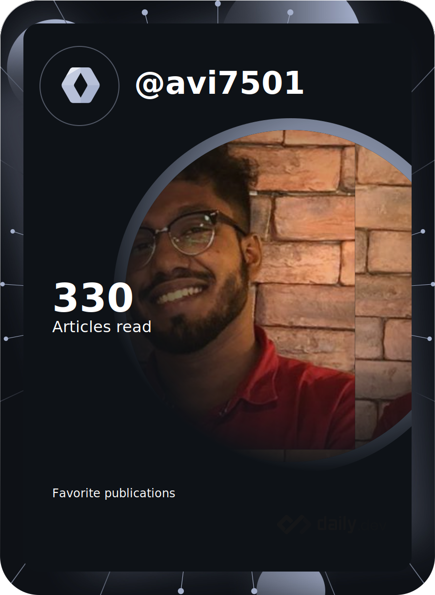

<table>
  <tr>
    <td style="vertical-align: top; width: 50%;">
      <h2>💫 About Me:</h2>
      

        🔭 I’m currently working on native iOS development 
        🌱 I’m currently learning NextJS 
        👯 I’m looking to collaborate on SwiftUI projects 
        🤔 I’m looking for help with distributed computing 
        💬 Ask me about tech and software dev 
        📫 How to reach me: avinashmuralidharan2@gmail.com 
      

      <h2>🌐 Socials:</h2>
      

        
        
      

      <h2>💻 Tech Stack:</h2>
      

        
        
        
        
        
        
        
        
        
        
        
        
        
        
        
        
        
        
        
        
        
        
        
      

    </td>
    <td style="vertical-align: top; width: 50%;">
      <h3>🃏 DevCard</h3>
      
    </td>
  </tr>
</table>

# 📊 GitHub Stats:
 
 

## 🏆 GitHub Trophies

### 🔝 Top Contributed Repo

---

